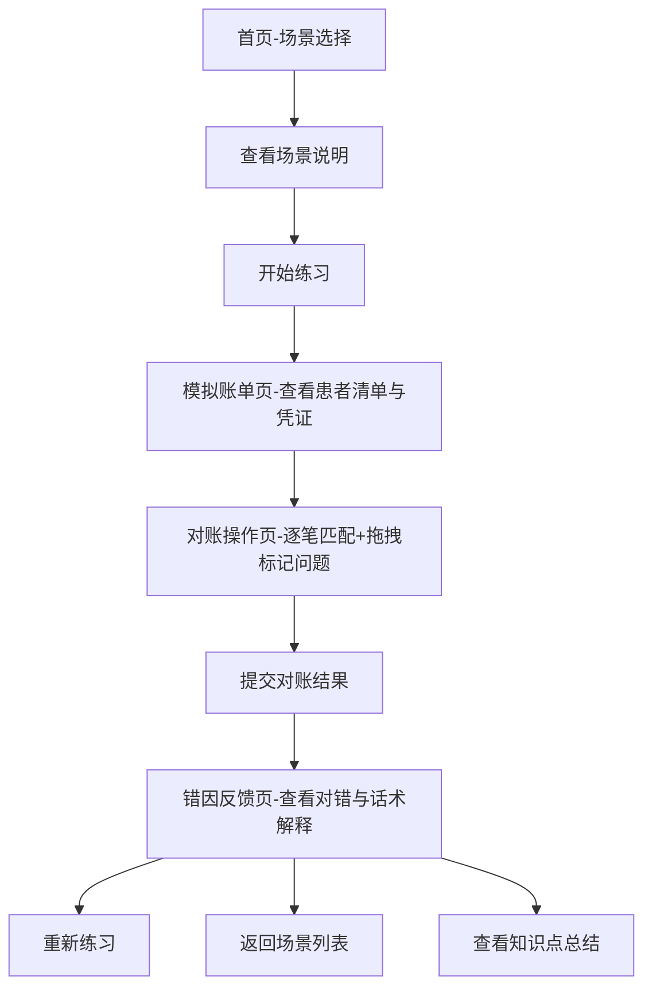

## 1. 产品概述

面向口腔连锁门诊的收银培训与新人上岗考核工具，将真实的日清对账流程拆解为可反复演练的模拟关卡。通过模拟账单、对账操作和错因反馈三个核心页面，帮助前台、收银员和咨询师掌握门诊收费核对技能，减少正式上岗后的日清返工。

- **目标用户**：口腔诊所前台、收银员、咨询师、培训讲师
- **核心价值**：降低培训成本，缩短新人上岗周期，标准化对账流程

---

## 2. 核心功能

### 2.1 用户角色

| 角色 | 说明 | 核心权限 |
|------|------|----------|
| 学员 | 前台、收银员、咨询师新人 | 选择场景、进行对账练习、查看错因反馈 |
| 培训讲师 | 门诊培训负责人 | 查看学员练习记录、管理场景配置 |

### 2.2 功能模块

1. **场景选择页**：展示练习场景卡片，支持难度筛选和场景说明
2. **模拟账单页**：呈现当日患者清单、各类收款凭证（微信/支付宝截图、现金登记、刷卡小票、医生减免单）
3. **对账操作页**：逐笔勾选匹配、拖拽问题标记到对应患者、提交对账结果
4. **错因反馈页**：显示对错判定、口腔门诊专业话术解释、知识点回顾

### 2.3 页面详情

| 页面名称 | 模块名称 | 功能描述 |
|----------|----------|----------|
| 场景选择页 | 场景卡片列表 | 展示6-8种典型场景，含场景名称、难度星级、预计时长、患者数量 |
| 场景选择页 | 筛选区 | 按难度等级、业务类型筛选场景 |
| 场景选择页 | 场景说明弹窗 | 展示场景背景、学习目标、注意事项 |
| 模拟账单页 | 患者清单区 | 列表展示当日所有患者的应收金额、收费项目、医生 |
| 模拟账单页 | 收款凭证区 | 按类型展示微信/支付宝截图、现金登记簿、POS刷卡小票、医生减免审批单 |
| 模拟账单页 | 凭证预览 | 点击凭证可放大查看详情 |
| 对账操作页 | 匹配勾选区 | 学员逐笔勾选，将收款凭证与患者账单对应匹配 |
| 对账操作页 | 问题拖拽区 | 将"未到账""重复收款""漏开票""退费未登记""金额不符"等问题标签拖到对应患者 |
| 对账操作页 | 进度提示 | 显示已匹配笔数、剩余笔数、可疑问题数 |
| 对账操作页 | 提交按钮 | 完成对账后提交，进入反馈页面 |
| 错因反馈页 | 得分概览 | 显示总体正确率、匹配正确数、问题识别正确数 |
| 错因反馈页 | 逐题反馈 | 对每位患者的对账结果逐一展示对错，用口腔门诊话术解释原因 |
| 错因反馈页 | 知识点卡片 | 归纳本次练习涉及的核心知识点，如"种植定金不能直接算治疗收入""正畸分期本次只核对当日实收" |
| 错因反馈页 | 操作区 | 重新练习、返回场景列表、查看知识点总结 |

---

## 3. 核心流程

用户进入工具 → 选择练习场景 → 查看当日模拟账单与收款凭证 → 逐笔匹配并标记问题 → 提交对账结果 → 查看错因反馈与话术解释 → 可选择重新练习或切换场景

---

## 4. 用户界面设计

### 4.1 设计风格

- **主色调**：医疗蓝 (#2563EB) 作为主色，搭配温暖米白 (#FAFAF7) 背景，体现专业感与亲和力
- **辅助色**：成功绿 (#10B981)、警告橙 (#F59E0B)、错误红 (#EF4444) 用于对账结果状态标识
- **按钮风格**：圆角胶囊形按钮，主按钮带微妙阴影，悬浮时有轻微上浮动画
- **字体**：标题使用思源宋体（专业稳重），正文使用思源黑体（清晰易读）
- **布局风格**：卡片式布局，左右分栏（左侧患者清单，右侧凭证区/问题区），桌面端优先
- **图标/emoji**：使用 Lucide 图标库，配合少量医疗相关 emoji 增加亲和力

### 4.2 页面设计概览

| 页面名称 | 模块名称 | UI 元素 |
|----------|----------|----------|
| 场景选择页 | Hero区 | 大标题"日清对账训练营"，副标题，每日一练入口 |
| 场景选择页 | 场景卡片 | 渐变背景卡片，含场景emoji图标、难度星级、患者数量徽章 |
| 模拟账单页 | 顶部信息栏 | 场景名称、日期、统计数据（应收总额、凭证总数） |
| 模拟账单页 | 患者清单 | 表格形式，斑马纹，悬浮高亮 |
| 模拟账单页 | 凭证区 | 分标签页切换（微信/支付宝/现金/刷卡/减免），凭证缩略图带悬停放大效果 |
| 对账操作页 | 患者卡片区 | 每位患者一张卡片，含应收金额、已匹配金额、问题拖放区 |
| 对账操作页 | 凭证待匹配区 | 横向滚动的凭证卡片列表，可拖拽 |
| 对账操作页 | 问题标签栏 | 固定在底部的问题标签，可拖拽到患者卡片 |
| 错因反馈页 | 得分仪表盘 | 环形进度条展示正确率，配数字动效 |
| 错因反馈页 | 患者反馈列表 | 可展开/折叠的手风琴列表，含对错图标、话术解释、知识点标签 |
| 错因反馈页 | 知识卡片 | 带渐变背景的卡片，含关键话术原文、解释、实际场景举例 |

### 4.3 响应式设计

- **桌面端优先**：默认设计适配 1440px 宽度
- **平板适配**：1024px 时调整为上下布局，患者清单在上，凭证区在下
- **移动端**：768px 以下简化布局，凭证改为全屏弹窗查看，拖拽改为点击选择+点击分配模式
- **触控优化**：移动端所有可交互元素最小尺寸 44px

---
