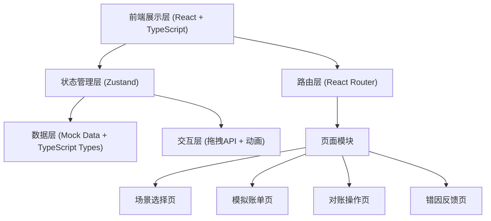

## 1. 架构设计



---

## 2. 技术描述

- **前端框架**：React@18 + TypeScript
- **构建工具**：Vite
- **样式方案**：TailwindCSS@3
- **状态管理**：Zustand
- **路由方案**：react-router-dom@6
- **图标库**：lucide-react
- **拖拽实现**：HTML5 原生 Drag and Drop API + 自定义封装
- **数据来源**：纯前端 Mock 数据（TypeScript 类型定义 + JSON 数据）
- **动画实现**：CSS Transitions + TailwindCSS 动画类

---

## 3. 路由定义

| 路由 | 页面名称 | 说明 |
|------|----------|------|
| `/` | 场景选择页 | 首页，展示所有练习场景 |
| `/scenes/:sceneId/bill` | 模拟账单页 | 展示患者清单与收款凭证 |
| `/scenes/:sceneId/reconcile` | 对账操作页 | 进行逐笔匹配与问题标记 |
| `/scenes/:sceneId/feedback` | 错因反馈页 | 展示对账结果与话术解释 |

---

## 4. 数据模型

### 4.1 数据类型定义

```typescript
// 场景类型
interface Scene {
  id: string;
  name: string;
  description: string;
  difficulty: 1 | 2 | 3 | 4 | 5;
  duration: number; // 预计时长（分钟）
  patientCount: number;
  icon: string;
  background: string;
  learningObjectives: string[];
  tips: string[];
}

// 患者类型
interface Patient {
  id: string;
  name: string;
  gender: '男' | '女';
  age: number;
  treatmentItem: string;
  doctor: string;
  receivableAmount: number; // 应收金额
  paymentMethod: PaymentMethod;
  expectedReceiptIds: string[]; // 应匹配的凭证ID
  issues: IssueType[]; // 该患者存在的问题
  feedback: FeedbackDetail;
}

// 收款凭证类型
interface Receipt {
  id: string;
  type: ReceiptType;
  amount: number;
  patientId?: string; // 关联的患者ID（正确匹配）
  payerName?: string;
  timestamp: string;
  transactionId?: string;
  cardLast4?: string;
  note?: string;
}

// 问题类型
type IssueType = 
  | 'not_received' // 未到账
  | 'duplicate_payment' // 重复收款
  | 'missing_invoice' // 漏开票
  | 'refund_not_recorded' // 退费未登记
  | 'amount_mismatch' // 金额不符
  | 'discount_not_approved' // 减免未审批
  | 'wrong_payment_method' // 支付方式错误;

// 反馈详情
interface FeedbackDetail {
  isCorrect: boolean;
  explanation: string; // 口腔门诊话术解释
  knowledgePoint: string; // 知识点
  example: string; // 实际场景举例
}

// 对账结果
interface ReconciliationResult {
  patientId: string;
  matchedReceiptIds: string[];
  selectedIssues: IssueType[];
  isCorrect: boolean;
}

// 练习状态
interface PracticeState {
  currentSceneId: string | null;
  step: 'bill' | 'reconcile' | 'feedback';
  matchedReceipts: Record<string, string[]>; // patientId -> receiptIds
  patientIssues: Record<string, IssueType[]>; // patientId -> issueTypes
  results: ReconciliationResult[] | null;
  score: number | null;
}
```

### 4.2 Mock 数据结构

```typescript
// 场景数据
const scenes: Scene[] = [
  {
    id: 'weekend-cleaning',
    name: '周末洁牙高峰',
    description: '周六门诊洁牙患者集中，含会员卡抵扣、现金、微信等多种支付方式',
    difficulty: 2,
    duration: 15,
    patientCount: 8,
    icon: '🦷',
    background: 'from-blue-50 to-cyan-50',
    learningObjectives: [
      '掌握会员卡充值与消费的对账方法',
      '熟悉周末高峰时段的快速核对技巧',
      '识别现金收款漏登记问题'
    ],
    tips: ['注意区分会员卡充值和消费金额', '现金收款务必核对登记本']
  },
  // ... 更多场景
];
```

---

## 5. 项目结构

```
src/
├── components/           # 公共组件
│   ├── layout/          # 布局组件
│   │   ├── Header.tsx
│   │   └── PageContainer.tsx
│   ├── ui/              # UI基础组件
│   │   ├── Button.tsx
│   │   ├── Card.tsx
│   │   ├── Badge.tsx
│   │   ├── Modal.tsx
│   │   ├── ProgressRing.tsx
│   │   └── Accordion.tsx
│   ├── scene/           # 场景相关组件
│   │   ├── SceneCard.tsx
│   │   ├── SceneFilter.tsx
│   │   └── SceneDetailModal.tsx
│   ├── patient/         # 患者相关组件
│   │   ├── PatientCard.tsx
│   │   ├── PatientTableRow.tsx
│   │   └── PatientReconcileCard.tsx
│   ├── receipt/         # 凭证相关组件
│   │   ├── ReceiptCard.tsx
│   │   ├── ReceiptTabs.tsx
│   │   ├── ReceiptPreviewModal.tsx
│   │   └── DraggableReceipt.tsx
│   └── issue/           # 问题相关组件
│       ├── IssueTag.tsx
│       ├── IssueDock.tsx
│       └── DropZone.tsx
├── pages/               # 页面组件
│   ├── SceneSelect.tsx
│   ├── BillView.tsx
│   ├── Reconcile.tsx
│   └── Feedback.tsx
├── store/               # 状态管理
│   └── usePracticeStore.ts
├── data/                # Mock数据
│   ├── scenes.ts
│   ├── patients.ts
│   └── receipts.ts
├── types/               # 类型定义
│   └── index.ts
├── utils/               # 工具函数
│   ├── format.ts        # 金额格式化
│   └── validation.ts    # 对账校验逻辑
├── hooks/               # 自定义Hooks
│   └── useDragDrop.ts
├── App.tsx
├── main.tsx
└── index.css
```

---

## 6. 状态管理设计

```typescript
// Zustand Store 设计
import { create } from 'zustand';

interface PracticeState {
  currentSceneId: string | null;
  step: 'select' | 'bill' | 'reconcile' | 'feedback';
  matchedReceipts: Record<string, string[]>;
  patientIssues: Record<string, IssueType[]>;
  results: ReconciliationResult[] | null;
  score: number | null;
  
  setCurrentScene: (id: string) => void;
  setStep: (step: PracticeState['step']) => void;
  matchReceipt: (patientId: string, receiptId: string) => void;
  unmatchReceipt: (patientId: string, receiptId: string) => void;
  addIssue: (patientId: string, issue: IssueType) => void;
  removeIssue: (patientId: string, issue: IssueType) => void;
  submitReconciliation: () => void;
  resetPractice: () => void;
}
```

---
